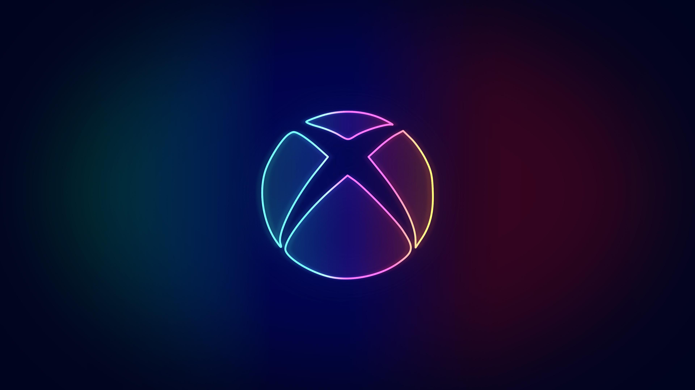

Microsoft is building an Xbox mobile store to directly offer games on mobile devices, challenging Apple and Google. The software giant first hinted at a “next-generation” store it would “build for games” [earlier this year](https://blogs.microsoft.com/on-the-issues/2022/02/09/open-app-store-principles-activision-blizzard/) but has now quietly revealed [details of the plans in filings](https://www.gov.uk/cma-cases/microsoft-slash-activision-blizzard-merger-inquiry) with the UK’s Competition and Markets Authority (CMA).

The CMA is currently investigating the [$68.7 billion Activision Blizzard acquisition](https://www.theverge.com/2022/1/18/22889258/microsoft-activision-blizzard-xbox-acquisition-call-of-duty-overwatch) and has asked Microsoft for context. In its filings, Microsoft says a big motivation for the purchase is to help build out its mobile gaming presence. Its plans for this space apparently include creating an Xbox mobile gaming platform and store. Here’s what the company says in the filings:

_Call of Duty: Mobile_ and _Candy Crush Saga_ are two hugely popular mobile games published by Activision and King, respectively, and Microsoft could leverage these titles to help build out a game store to rival Google Play and the App Store. Given Apple’s policies blocking third-party app stores on iOS, it’s difficult to imagine Microsoft competing on iPhones anytime soon. But that’s clearly not stopping it from envisioning an Xbox mobile app store.

Microsoft’s acknowledgment of a mobile gaming push comes as the company increasingly positions Xbox Cloud Gaming as an option for mobile gaming on emerging handhelds. Microsoft was quick to [support Xbox Cloud Gaming on Valve’s Steam Deck](https://www.theverge.com/22985166/xbox-cloud-gaming-steam-deck-microsoft-edge-beta), followed by a partnership with [Logitech](https://www.theverge.com/23405040/logitech-g-cloud-gaming-handheld-review-game-streaming-android-xbox-nvidia-geforce-now) and [Razer](https://www.theverge.com/2022/10/15/23392481/razer-edge-android-cloud-gaming-tablet-qualcomm-price-release-date-specs) for their cloud gaming-focused handhelds. That means a push into mobile gaming could happen on multiple fronts — not just on phones and tablets.

