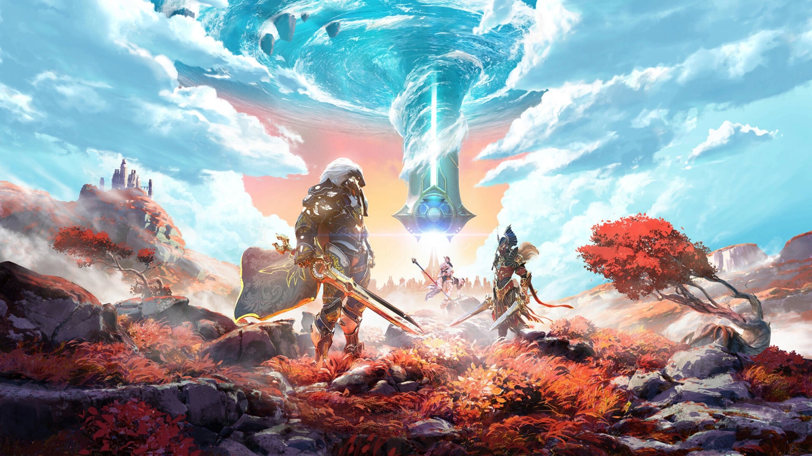

import ReactPlayer from "react-player";

Yesterday, gaming website _IGN_ <ReactPlayer controls url="https://www.youtube.com/watch?v=-5skDimNwKo&t=149s) for another title called _Lords of the Fallen_, a “spiritual successor to the popular soulslike action-RPG” to a game with the same name released in 2014. Later this year comes the “action role-playing” _Atlas Fallen_, while February showed that even VR isn’t spared with _After the Fall_. Add to that the launch of _Redfall_, a [much-maligned](https://www.theverge.com/23715862/redfall-review-xbox-pc" /> “co-op looter-shooter,” and you have to ask yourself: why do so many games have “fall” in their names?

For one, the English language offers so many other exciting words here. Plummet, tumble, topple over. Don’t tell me you wouldn’t play _Ashplummet_ or _Lords of the Tumble_? (If it was on Game Pass.)

What do these fall-type games signal to us? Well, many of these titles suggest that there will be a vague, uninspired fantasy world, with a dash of sci-fi or steampunk, that the player might be dropped into these environments and be rewarded for their button mashing with familiar-looking particle effects, that there may be the opportunity to do some looting, and perhaps shooting. Or maybe game devs are just showing reverence to the [universally beloved](https://www.metacritic.com/game/playstation-5/godfall) 2020 action RPG looter-slasher _Godfall_?

Mostly, I just want commercial games studios to show a little creativity when it comes to naming. If there is some kind of secret industry requirement to include the word “fall,” at least have the decency to relegate it to a subtitle, like this year’s soulslike _Wo Long:_ _Fallen Dynasty_ or the expansion for live service looter-shooter _Destiny 2: Lightfall_.

Going forward, I demand more effort in titling games. I’ll grandfather existing series, like _Fallout_, which has been around for three decades, or _Fall Guys_, in which characters actually, literally fall. But for everyone else: find a new word!

Or, you know, make a game that is not a drab action fantasy RPG looter-shooter?

