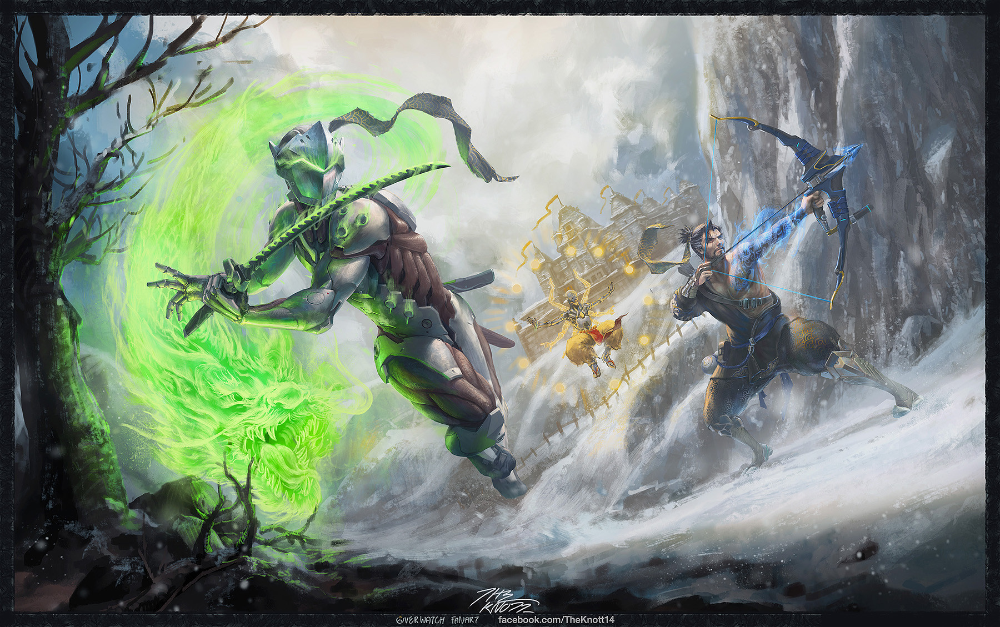

Keller explained that Hero Mode had been in development since _Overwatch_’s launch in 2016 and that it apparently was part of the vision the team had for [Project Titan](https://www.polygon.com/2014/9/23/6833953/blizzard-cancels-titan-next-gen-mmo-pc) — the canceled FPS MMO from which _Overwatch_ was born.

“When we launched _Overwatch_ in 2016, we quickly started talking about what that next iteration could be,” he wrote. “Work began on the PvE portion of the game and we steadily continued shifting more and more of the team to work on those features.”

Keller said that as development continued on Hero Mode, the scope simply grew too big.

“We were trying to do too many things at once and we lost focus,” he wrote. “We had an exciting but gargantuan vision and we were continuously pulling resources away from the live game in an attempt to realize it.”

In the first few years of _Overwatch_ prime’s existence, the game was regularly updated with holiday-themed content. New game modes and features, like Deathmatch and the creator's workshop, kept the game relatively fresh. But around 2019, when _Overwatch 2_ was announced, the game was starting to feel the effects of Blizzard internally focusing on developing PvE content. It’s why the game went two years between hero releases when they had been previously released every 4-5 months.

As development on _Overwatch 2_ continued, the team made the decision to essentially bifurcate the game’s release rather than continuing to delay it. The competitive multiplayer part of the game would come first, [landing in October 2022](https://www.theverge.com/2022/10/4/23387041/overwatch-2-review-new-battle-pass-heroes-maps), and the PvE portion would come sometime in 2023.

“After Overwatch 2 had launched, we started refining our plans for future seasons,” Keller wrote. “As those plans grew, we tried to find ways to make all of our ambitions fit together in a plan that we believed in. We couldn’t. [...] So, we made the difficult decision to cut Hero Missions and started planning for the future.”

Keller then apologized, acknowledging just how much the _Overwatch_ community and development team were invested in Hero Mode while taking personal responsibility for its failure.

“This has been hard for us, but as the director on this project, I have to do my best to make decisions that put the game and the community first, even when those decisions are disappointing,” he wrote. “In this case, I had trouble pivoting away from a vision that just wasn’t working. And for that I would like to apologize to our players and to our team. I’m sorry.”

